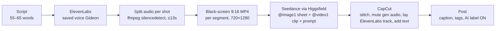

# Production Pipeline (current best method)

> [!success] Winning method (A/B tested): **Test A**
> Character reference image + audio + full scene prompt → video in one pass. Fewer steps, better results than generate-still-then-animate.



## Steps

1. **Script** — follow [[Script Format]]. Target 55–65 words ≈ 29 seconds. Create from [[Script Template]].
2. **Voice** — generate in ElevenLabs with the saved Gideon voice. Settings in [[Voice Spec]].
3. **Split audio per shot** at the pauses (ffmpeg `silencedetect`). Each segment ≤13s. See [[Audio Splitter]].
4. **Convert each segment to a black-screen 9:16 video** (720×1280). Seedance follows a black-screen *video* reference more reliably than a raw audio file for lip-sync.
5. **Generate in Seedance** (via Higgsfield):
   - `@image1` = master character sheet (identity reference, NOT first frame)
   - `@video1` = black-screen audio clip
   - Prompt = the five [[Prompt Blocks]] + that shot's section + `Lip-sync strictly: "<exact line>"`
   - Duration = clip length
   - Seedance 2.0: max 15s per generation → generate per shot and stitch.
   - Seedance 2.5: up to 30s multi-shot in one pass.
6. **Edit in CapCut** — stitch shots, **mute generated audio, lay the original ElevenLabs track back on top**, add any on-screen text (tickers, "not financial advice") manually.
7. **Post** — caption and hashtags per [[Caption Format]], AI-content label ON. Run the [[Pre-Post Checklist]].

## ffmpeg snippets

Detect pauses:
```bash
ffmpeg -i gideon_v2.mp3 -af silencedetect=noise=-35dB:d=0.35 -f null - 2>&1 | grep silence_
```

Cut a segment (example: shot 2, 4.2s → 15.0s):
```bash
ffmpeg -i gideon_v2.mp3 -ss 4.2 -to 15.0 -c copy shot2.mp3
```

Black-screen 9:16 video from a segment:
```bash
ffmpeg -f lavfi -i color=c=black:s=720x1280:r=24 -i shot2.mp3 -shortest -c:v libx264 -pix_fmt yuv420p -c:a aac shot2_black.mp4
```

## Related
[[Shot Writing Rules]] · [[Prompt Blocks]] · [[Home Location]] · [[Voice Spec]] · [[Pre-Post Checklist]] · [[Shot Director]]
