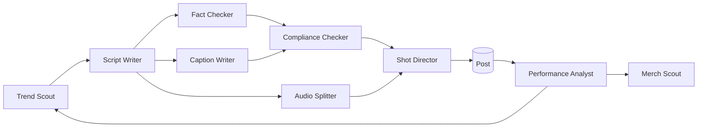

# Agentic Workflows

Each agent has its own note with a system-prompt-ready brief. Load [[Source/GIDEON Handover 2026-09-29|the handover]] (or this vault) into any agent that writes scripts, builds prompts, generates assets, writes captions, or plans content.

| Agent | Input | Output | Notes |
|---|---|---|---|
| [[Trend Scout]] | TikTok trending sounds/memes, AI/quantum/crypto news | 3–5 hooks that fit Gideon + the "___ time in my life" blank | Filters for on-brand topics only |
| [[Script Writer]] | Hook + topic | 55–65-word script following [[Script Format]] | Validates: no contractions, one true fact, NFA close, conviction tone ≥70% |
| [[Fact Checker]] | Script | Pass/fail on the "real insight" line | Gideon must be right |
| [[Shot Director]] | Final script + audio timestamps | Full Seedance prompt using [[Prompt Blocks]], 3–4 cuts, blocking, lip-sync lines | Enforces NO TEXT + inside-the-railing + one-location rules |
| [[Audio Splitter]] | ElevenLabs MP3 | Per-shot black-screen 9:16 MP4s ≤13s | ffmpeg silencedetect + cut in pauses |
| [[Caption Writer]] | Script | Caption + hashtags per [[Caption Format]] | Lowercase, ≤6 tags |
| [[Compliance Checker]] | Script + caption + deal info | Flags: tickers, sponsorship disclosure, real people, employer mentions | Hard-blocks undisclosed paid promos |
| [[Performance Analyst]] | Post metrics (views, watch time, comments, shares) | Which hooks/topics/lines to double down on | Feeds Trend Scout |
| [[Merch Scout]] | Top-performing lines from comments | Merch drop candidates | Lines people quote = products |
